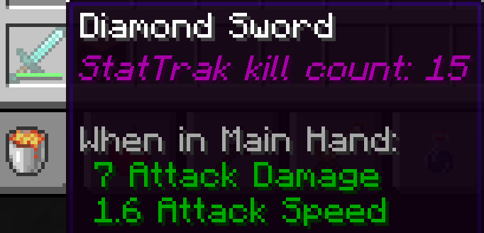

# Fabric Serverside Item Kill Tracker

Entirely server sided plugin that tracks kills from items and appends it to the item's lore description.

## License

This template is available under the CC0 license. Feel free to learn from it and incorporate it in your own projects.
